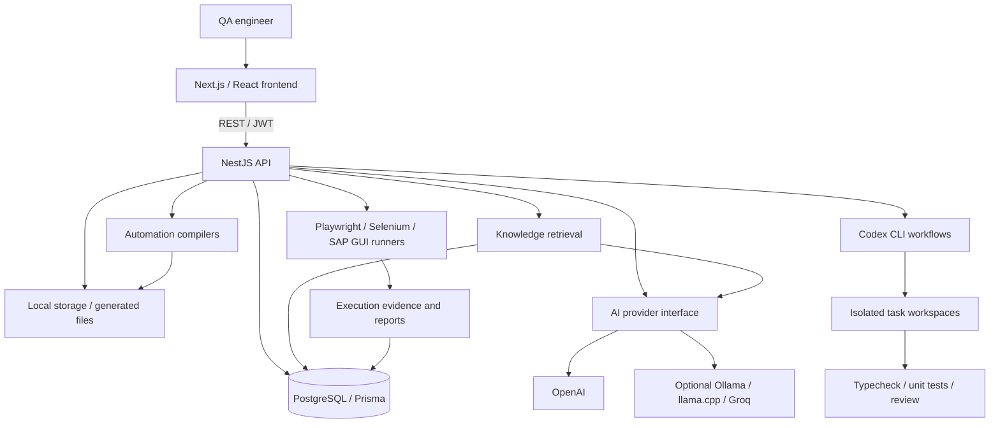

# TestPilot AI

**Learn the product. Build the library. Automate anything.**

TestPilot AI is a full-stack QA automation application that brings product knowledge, reusable UI objects, manual test cases, generated automation and execution evidence into one workflow. The current application uses a Next.js frontend and NestJS API backed by PostgreSQL. It includes AI-assisted analysis and a Codex CLI engineering workflow for investigating and repairing TestPilot itself.

## Overview

Maintaining automation requires more than generating code: testers need reliable locators, understandable requirements, reusable data and evidence explaining failures. TestPilot stores these as application-scoped records and connects them through scanning, recording, mapping, flow construction, generation and reporting.

This repository includes the active **v2 application**, an older FastAPI/Vite implementation, and historical HTML design assets. The root Docker Compose file runs the legacy application. Use the v2 instructions below for the current UI.

## Key Features

- Application hierarchy, JWT authentication, refresh tokens and role-based access checks.
- Web scanning and interactive browser recording; SAP GUI scanning utilities for configured Windows environments.
- A reusable Object Library with locator verification, confidence and lifecycle information.
- Test-case import, analysis, generation, test data and automation-flow editing.
- Deterministic Playwright, Selenium Java and SAP GUI script compilers, including hybrid flow segmentation.
- Script review, execution records, failure analysis, evidence and locator repair suggestions.
- Knowledge-file ingestion, chunking, embeddings and application-scoped retrieval.
- Jira/Zephyr integrations and a Jira-to-Codex import workflow.
- Database-backed reports, pipeline status and bug reports.
- An AI Engineering task workflow with isolated working copies, specialist repair, advisory review and real typecheck/test verification.

Features depend on configuration and available tools. SAP GUI requires a real installed client and an authorized session. Generated scripts and live execution are separate operations.

## Architecture



See [Architecture](docs/ARCHITECTURE.md) for component responsibilities, data flow and current limitations.

## AI Architecture

The `AiProvider` interface supplies text, JSON and embedding operations. Existing implementations support OpenAI, Ollama, llama.cpp and Groq. The factory currently defaults to Ollama; the example configuration explicitly selects OpenAI. OpenAI defaults are identifiable in source as `gpt-4o-mini` and `text-embedding-3-small`, and can be overridden. Other providers use their own environment settings; Groq does not provide embeddings in this implementation.

Knowledge ingestion stores document chunks and optional embeddings in PostgreSQL. RAG ranks application-scoped chunks using cosine similarity in the backend; there is no separate vector database service. Prompts live in backend service code. JSON parsers accept fenced/prose-wrapped JSON and reject unparseable responses; TypeScript generics alone do not provide complete runtime schema validation.

Codex CLI is a **separate AI path** used by script review, certain generation/import workflows and AI Engineering. Its model and authentication come from the CLI configuration, not `OPENAI_MODEL`. AI Engineering has project-manager triage, backend/frontend specialists, database-related escalation, advisory reviewer and QA verification responsibilities. These are workflow roles and chat personas, not six permanently running servers. Some clean, verified, non-schema fixes can auto-apply; other tasks await review. Isolated frontend verification currently runs typechecks but skips its test phase; backend verification runs Jest. The reviewer and QA roles must not be described as unconditional human approval.

No mock AI provider was added for publication. Existing v2 operations can record unavailable enrichment or review when an external AI call fails. These limitations are documented, rather than presented as successful AI execution.

## Technology Stack

| Area | Current v2 technology |
| --- | --- |
| Frontend | Next.js 16, React 19, TypeScript, Tailwind CSS |
| UI/data | Base UI, TanStack Query, Axios, React Flow, Motion |
| Backend/API | NestJS 11, TypeScript, REST, Socket.IO scan gateway |
| Validation/auth | class-validator, Nest validation pipe, JWT, bcrypt |
| Persistence | PostgreSQL, Prisma 7, Prisma PostgreSQL adapter |
| AI | OpenAI SDK, optional compatible providers, Codex CLI |
| Automation | Playwright, Selenium Java/Maven, Windows SAP scripting |
| Unit tests | Jest/ts-jest, Vitest, Python pytest for legacy |
| Legacy | FastAPI, SQLAlchemy, Pydantic, React/Vite, SQLite/PostgreSQL |

## Project Structure

```text
backend-v2/
  src/common/             Shared policy, crypto, CLI and reconciliation utilities
  src/modules/            REST modules and application workflows
  src/prisma/             PostgreSQL-backed Prisma service
  prisma/schema.prisma    Current database schema
  prisma/seed.ts          Configured initial admin creation
  runner/                 Runner configuration; generated tests are excluded
frontend-v2/
  src/app/                App Router pages
  src/components/         UI components
  src/lib/                API client, authentication, types and shared state
  e2e/                    Browser workflow tests
backend-legacy/           Earlier Python API and its tests
frontend-legacy/          Earlier React/Vite client
runner-scripts/           Illustrative framework samples
scripts/                  Optional local AI setup tooling
pages/, js/, index.html   Historical HTML design assets
docs/                     Architecture, setup and interview documentation
```

Local databases, uploads, captured HTML, company-derived knowledge, generated scripts, screenshots, credentials and tool binaries are intentionally excluded. Historical SQLite migrations are retained as schema history, not PostgreSQL deployment migrations.

## Getting Started

### Prerequisites

Use Node.js 22 or newer with npm and Git. Provide PostgreSQL, or use Prisma Dev for local development. Configure an OpenAI account/key for the recommended AI mode. Codex CLI is optional for basic CRUD but required for its specific workflows. Browser execution needs Playwright Chromium; Selenium needs Java 17 and Maven; SAP functionality needs Windows and SAP GUI scripting prerequisites.

### Clone and install

```powershell
git clone https://github.com/paviarora588-1/TestPilot.git
cd TestPilot
npm ci
cd backend-v2
Copy-Item .env.example .env
cd ../frontend-v2
Copy-Item .env.example .env.local
cd ..
```

Edit the local backend environment file. Set `DATABASE_URL` to your **direct PostgreSQL connection URL**, `OPENAI_API_KEY`, `JWT_ACCESS_SECRET`, `INTEGRATION_ENCRYPTION_KEY`, `SEED_ADMIN_EMAIL` and `SEED_ADMIN_PASSWORD`. Choose a unique admin password of at least 12 characters. Generate distinct secrets locally, for example by running this command twice and using a different result for each secret:

```powershell
node -e "console.log(require('crypto').randomBytes(32).toString('hex'))"
```

Never commit these values. Keep the encryption key stable for an existing database; changing it requires a credential migration.

### Local database setup

For a **new local database**, start Prisma Dev in another terminal:

```powershell
cd backend-v2
npx prisma dev --name testpilot --port 51213 --db-port 51214 --shadow-db-port 51215
```

Copy its direct `postgres://` connection URL into your private `backend-v2/.env`. The application adapter needs the direct URL, not the `prisma+postgres://` URL.

Then, in a separate terminal:

```powershell
cd backend-v2
npx prisma generate
npx prisma db push
npm run prisma:seed
```

`db push` is for a new empty database. Do not use reset or data-loss flags against an existing installation. The seed creates the configured user only if absent and does not reset passwords. For an existing saved Prisma Dev instance, use `npx prisma dev start testpilot` instead of recreating it.

### Start the application

Run the backend from its own directory:

```powershell
cd backend-v2
npm run start:dev
```

Run the frontend in another terminal:

```powershell
cd frontend-v2
npm run dev
```

Open **http://localhost:3000** and sign in with your configured account. The API is **http://localhost:4000/api**. Verify HTTP reachability with `Invoke-RestMethod http://localhost:4000/api` and provider reachability with `Invoke-RestMethod http://localhost:4000/api/health/ai`. The base API returns `Hello World!`; this is not a comprehensive readiness probe. V2 has no general `/api/health` route. `/api/health/codex` performs a real AI call and should not be polled as a routine health check.

Optional execution preparation:

```powershell
cd backend-v2
npx playwright install chromium
```

Authenticate an installed Codex CLI locally when using Codex workflows. Never put authentication tokens in this repository. See [Run guide](docs/RUN_TESTPILOT_V2.md).

## Environment Variables

Values are intentionally omitted. See the example files for safe defaults and empty secret fields.

| Scope | Names |
| --- | --- |
| Backend required | `DATABASE_URL`, `JWT_ACCESS_SECRET`, `INTEGRATION_ENCRYPTION_KEY` |
| Initial admin | `SEED_ADMIN_EMAIL`, `SEED_ADMIN_PASSWORD` |
| OpenAI configuration | `AI_PROVIDER`, `OPENAI_API_KEY`, `OPENAI_MODEL`, `OPENAI_EMBEDDING_MODEL` |
| Backend HTTP | `PORT`, `FRONTEND_ORIGIN` |
| Optional Ollama | `OLLAMA_BASE_URL`, `OLLAMA_MODEL`, `OLLAMA_EMBEDDING_MODEL` |
| Optional llama.cpp | `LLAMACPP_BASE_URL`, `LLAMACPP_MODEL`, `LLAMACPP_EMBEDDING_BASE_URL` |
| Optional Groq | `GROQ_API_KEY`, `GROQ_MODEL` |
| Frontend | `NEXT_PUBLIC_API_BASE_URL` |
| Browser tests | `E2E_ADMIN_EMAIL`, `E2E_ADMIN_PASSWORD` |
| Legacy Compose | `POSTGRES_PASSWORD`, `LEGACY_DATABASE_URL`, `OPENAI_API_KEY`, `API_AUTH_TOKEN` |

Only the public API base URL should be exposed through `NEXT_PUBLIC_` settings. Integration credentials are configured through the application and encrypted at rest.

## Running Tests and Builds

From the repository root:

```powershell
npm run build --workspace=backend-v2
npm run build --workspace=frontend-v2
npm run test --workspace=backend-v2 -- --runInBand
npm run test --workspace=frontend-v2
npm run lint --workspace=frontend-v2
```

For a non-mutating backend lint check:

```powershell
cd backend-v2
npx eslint "{src,apps,libs,test}/**/*.ts"
```

The backend's `npm run lint` includes `--fix` and modifies source. Existing lint debt is recorded in [Verification](docs/PUBLISH_VERIFICATION.md). Frontend production builds fetch Google Fonts and require network access.

Browser E2E tests require both servers, an isolated seeded test database, browser binaries and test-account environment variables. They can create application data and invoke external AI/automation; they are not a safe generic startup check.

Legacy checks use Python 3.12 and `backend-legacy/requirements.txt`:

```powershell
python -m pip install -r backend-legacy/requirements.txt
python -m compileall backend-legacy/app
python -m pytest backend-legacy/tests
```

Legacy frontend setup/build is separate: `npm ci` and `npm run build` from `frontend-legacy`.

For built v2 serving, build both workspaces, then run `npm run start:prod` from `backend-v2` and `npm run start` from `frontend-v2` in separate terminals. This is local serving, not a hardened deployment configuration.

## Example Workflow

Create an application for a test site you own, ingest its product documentation, then scan or record a login/search flow. Verify the discovered objects, import or author manual test cases, analyze/map steps and build an automation flow with reusable test data. Generate framework-specific code, inspect the review and resolve blockers. When explicitly ready to run against the authorized test site, execute it and inspect step results, evidence and failure reports. Review locator repair suggestions before relying on them in future runs.

## Screenshots

Sanitized screenshots of a synthetic demo application can be added here. Existing local screenshots and enterprise captures are excluded from publication.

## Current Limitations and Future Improvements

- V2 has live OS/browser runners and does **not** currently enforce the legacy `ENABLE_LOCAL_RUNNER=false` flag. Do not expose runner endpoints to untrusted users; no live runner was invoked during publication verification.
- The v2 policy does not fully enforce the documented knowledge-first Golden Automation Rule. Missing AI review can be recorded as unavailable rather than blocking execution. Provider defaults also differ from the OpenAI-only product rule. These are existing architecture gaps, not completed guarantees.
- Static scan/execution assets need authenticated access, retention policy and stronger tenant isolation before deployment.
- Improve structured AI output validation, upload/path constraints, database migration management, secret rotation and deployment readiness checks.
- Replace shared runner directories with isolated jobs; expand frontend coverage and fix lint debt.
- Strengthen scheduling, cancellation and AI Engineering approval controls; add CI and sanitized demo evidence.

See [Interview guide](docs/INTERVIEW_GUIDE.md) for an implementation-based explanation and [Publication audit](docs/PUBLISH_SECURITY_AUDIT.md) for scope and exclusions.
