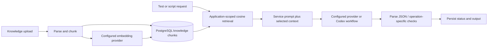

# TestPilot AI Architecture

## Scope and components

The active system is `frontend-v2` plus `backend-v2`. The frontend uses the Next.js App Router; application pages call `src/lib/api.ts` through the Axios client in `src/lib/api-client.ts`. TanStack Query coordinates fetching and invalidation. Auth state and application selection are shared through React contexts.

The NestJS `AppModule` composes authentication, applications, scanner, object library, test cases, test data, automation builder, script generation, execution, reporting, knowledge base, RAG, integrations, pipeline, policy, recorder and AI Engineering modules. HTTP routes use the `/api` prefix. A Socket.IO gateway supports scan communication. DTO validation uses Nest's global validation pipe with transformation and whitelisting.

Prisma uses a direct PostgreSQL connection and the `PrismaPg` adapter. The schema contains users/refresh tokens, application hierarchy, scan results, reusable objects, test cases and data, flows, scripts, execution records, knowledge sources/chunks, integrations, bug reports and AI Engineering tasks. The generated client is recreated with `prisma generate`; local database contents are not shipped.

Local files beneath `backend-v2/storage` hold knowledge uploads, scans, generated scripts and execution evidence. File metadata and workflow status are persisted in PostgreSQL. These files can contain customer information and are excluded from Git. Application-specific paths are created at runtime.

## Request flow

1. A signed-in frontend sends a REST request with its access token.
2. JWT strategy validates the token and loads the active user; route guards apply configured role restrictions.
3. A controller validates its DTO and calls the relevant service.
4. The service reads/writes Prisma records and may create files, run AI operations or schedule asynchronous work.
5. The frontend consumes the real response, refreshes queries and renders status/errors/evidence.

Refresh tokens are random values whose hashes are persisted. Initial admin passwords are bcrypt-hashed; publication preparation removed the default seed password and password logging. Access-token signing requires a configured secret. Integration and sensitive recording credentials use AES-256-GCM with a key derived from configured secret material; changing the key for existing data requires migration.

## Knowledge and AI flow

The `AiProvider` interface is injected into consumers. The implementation supports OpenAI, Ollama, llama.cpp and Groq; Groq embeddings explicitly fail. Publication templates select OpenAI while retaining existing alternatives. The current factory default remains Ollama. OpenAI uses the SDK for chat completion and embeddings. Codex workflows launch a separately authenticated CLI process.

Prompts are assembled in service code. Provider JSON handling strips fences and extracts a balanced object/array before parsing. Codex has its own JSON parsing helpers. These are parsing mechanisms, not universal schema validators. Some operations degrade to unavailable AI enrichment, empty RAG context or unavailable review; documentation must distinguish this from successful analysis.

RAG stores embeddings as database JSON and ranks candidates in application memory. This is simple for a local installation but lacks an indexed vector search service and embedding-version management.

## Automation pipeline

Scanning/recording feeds the Object Library. Test-case analysis and mapping connect manual steps to reusable objects. Automation Builder stores an ordered flow. Compilers emit Playwright TypeScript, Selenium Java or SAP GUI VBScript/PowerShell; hybrid generation splits a flow into contiguous driver segments.

Script review is a distinct Codex-backed operation. Generation can trigger review asynchronously. The current generation policy checks step/object assignment and confidence, while execution policy checks supported framework, spec availability, recorded risk and certain review failures. It does not yet implement every knowledge-first prerequisite in the product rules, and unavailable review does not always block. Those are existing gaps requiring follow-up work.

Execution dispatches to real subprocess runners, writes step evidence and records results. Failure analysis combines deterministic classification with AI-assisted explanation and locator-repair proposals. High-confidence repairs can auto-apply. Shared runner directories are serialized within a process, rather than isolated across multiple API instances.

V2 does not enforce the legacy local-runner flag. No live browser, SAP or Maven execution was used in publication verification. Running these workflows requires explicit selection of authorized test targets and should remain a trusted local activity until isolation and deployment controls improve.

## AI Engineering roles and orchestration

The AI Engineering module manages tasks about TestPilot's own code. It is separate from the application's test-generation workflow.

| Role/persona | Implemented responsibility |
| --- | --- |
| Project manager / Pavi | Triage, plan and select backend/frontend/both scope |
| Backend / Dev | Backend specialist repair in a task workspace |
| Frontend / Fiona | Frontend specialist repair in a task workspace |
| Database / Sam | Database-related discussion and schema escalation |
| Reviewer / Val | Advisory review of proposed changes |
| QA / Robo | Explain verification and recorded suite results |

Specialist and review operations call Codex CLI. Each task uses working copies under `.ai-tasks`, with source constraints and dependency junctions. Diffs and verification outcomes are stored with task records. Clean, non-schema work can auto-apply when its implemented eligibility checks pass; other work waits for review. Do not claim that every patch always requires human approval.

An important current limitation: isolated frontend verification runs TypeScript checks but labels its test phase as having no automated suite, despite the main frontend now having Vitest tests. Backend verification runs Jest. Separate suite-report operations can run the main frontend tests. Strengthening this gate is future work.

Backend workspace setup must include anything referenced by Jest configuration; publication test setup is kept in `src/common` so it is present in those working copies.

## Integrations and external dependencies

Jira/Zephyr integration settings and sync logs are database-backed. Sensitive tokens are encrypted at rest. The Jira-Codex import module uses separate CLI-driven processing. Actual availability depends on the user's configured service URL, permissions and credentials; no company endpoints are distributed.

Playwright needs Chromium. Selenium needs Java/Maven. SAP scanning/execution relies on Windows scripting, an installed SAP client and an accessible session with scripting enabled. These tools are optional for CRUD and core UI operation.

## Legacy and historical assets

`backend-legacy` uses FastAPI, SQLAlchemy, Pydantic and Python AI providers; `frontend-legacy` uses React/Vite. Root Docker Compose targets that pair. Root HTML/JS/pages are historical design assets, not the live v2 frontend. The saved SQLite migrations under v2 are historical reference, not a current PostgreSQL migration sequence.

## Design choices and tradeoffs

- Application-scoped data and reusable objects make flows traceable but require stronger isolation checks for deployment.
- Deterministic compilers give reproducible syntax while AI adds interpretation/review; they do not prove business correctness.
- Provider injection makes integrations replaceable, but provider capabilities and defaults differ.
- Local subprocess execution is convenient for a single-user installation but does not provide a hardened execution sandbox.
- In-process jobs and startup reconciliation are easy to operate locally but lack durable queueing and cross-instance coordination.
- Startup reconciliation currently reports a Prisma Dev bind-parameter warning for AI tasks on this installation; other startup steps and HTTP serving still work.

Future work should prioritize strict prerequisite enforcement, authenticated evidence serving, safe runner isolation, comprehensive structured-output validation, upload/path hardening, indexed retrieval, frontend verification and deployment migrations.
